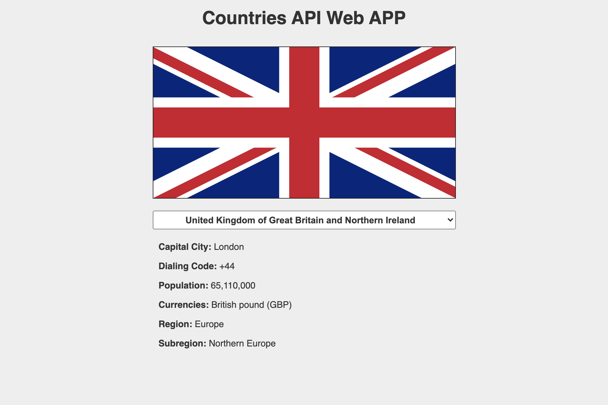
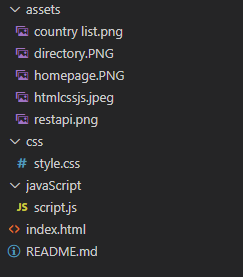

# Countries Data using an API

# Table of contents

## Mission

The Countries API Web App allows the user to access useful information about any country in the world at the click of a button.

### Countries Web App. 

The Countires Web App works on desktop, tablet and mobile devices. The app can be used for a variety of purposes including educational to support project facts or for potential travellers researching destinations. The app comprises of a simple dropdown box where the user selects the desired country. This then changes the view and information given so that it is relevant to the country selected, including flag, capital city, poulation, currency and dialling code.

### Countires Web App interface

## This was built using :

- [HTML](https://en.wikipedia.org/wiki/HTML)
- [CSS](https://en.wikipedia.org/wiki/Cascading_Style_Sheets)
- [JS](https://en.wikipedia.org/wiki/JavaScript)
- [REST API](https://en.wikipedia.org/wiki/Representational_state_transfer)

## How does this work?

This is a web app build with **HTML** - **CSS** - **JS**, it uses a **REST API** and the endpoints are provided by [Rest Countries](https://restcountries.eu/) to fetch the data of different countries.

#### All the below parameters are fetched from the REST API we've used:

    - Flag
    - Capital city
    - Dialing code
    - Population
    - Currencies
    - Region
    - Subregion

#### The country list is also getting the country data from the API we have used.

### Project Directory

## UX

### Design Choices

Colours - The background is clean off white using Hex Code #eee. This ensures the flag and accompanying information are clear and distinctive. 

Styling - The app uses a simple layout containing a dropdown menu for easy functionality. The information headers remain fixed aligned therefore providing a simple, consistent view of the information provided.

Fonts - The font used is: Helvetica, Arial, sans-serif. Headers are shown in bold making it clear to read and to distinguish between the information header and information the api provides.

Images - The images are of the flag of the country selected. This provides an interesting visual to accompany the factual information listed.

### Wireframe

The wireframes was created using [Balsamiq](https://balsamiq.com/wireframes/desktop/), this was the initial part of the project in the planning stage.

These are available in both [mobile](wireframe/Mobile copy.png) and [desktop](wireframe/New Mockup 1.png) versions.
